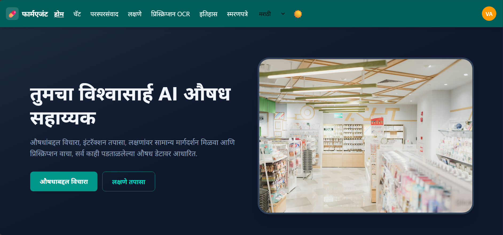
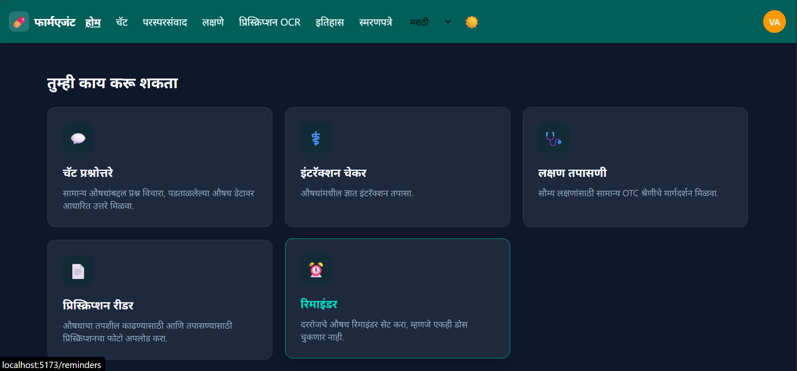
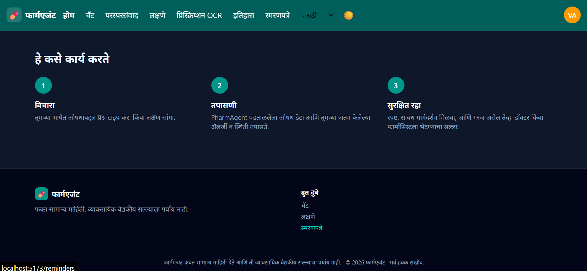
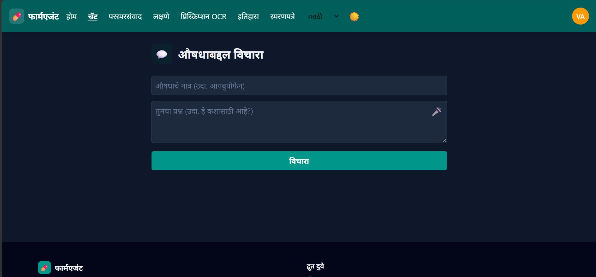
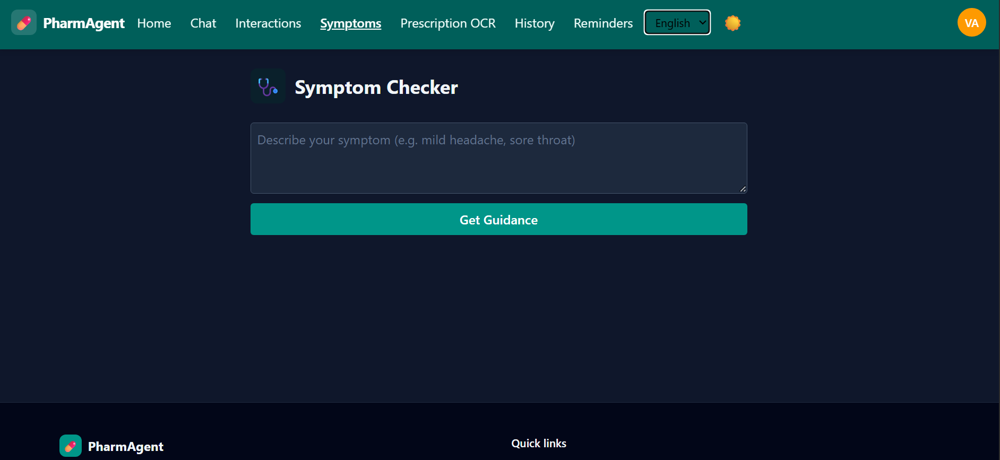
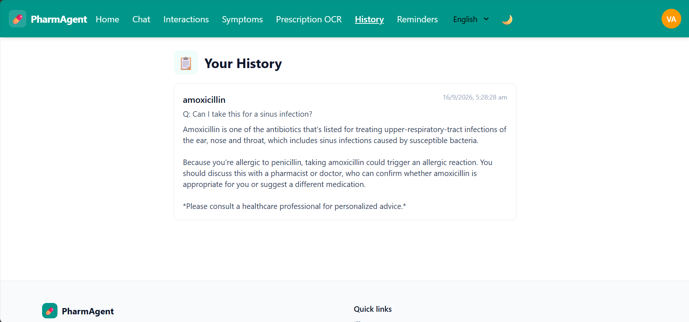

# PharmAgent — AI Medicine Assistant

PharmAgent is an AI-powered medicine assistant that answers medicine questions, checks drug interactions, offers general OTC-category symptom guidance, and reads prescription images — all grounded in verified drug data rather than guessed. It supports English, Hindi, and Marathi throughout the interface and AI responses, including translated emergency detection for the symptom checker.

> **Disclaimer:** PharmAgent gives general information only and is not a substitute for professional medical advice. Always consult a doctor or pharmacist before taking any medicine.

## Screenshots

**Home**





**Chat**



**Symptom Checker**



**Light mode**



## Features

- **Chat Q&A** — ask questions about common medicines, grounded in verified drug data and the user's saved allergies/conditions
- **Interaction Checker** — check known interactions between two or more medicines
- **Symptom Checker** — general OTC-category guidance for mild symptoms, with emergency keyword detection (English, Hindi, Marathi) that redirects to emergency care instead of AI advice
- **Prescription Reader (OCR)** — upload a prescription photo to extract and verify medicine names via Tesseract OCR + fuzzy matching + OpenFDA fallback
- **Reminders** — set daily/weekly medicine reminders with browser notifications
- **Profile** — save allergies, chronic conditions, and current medications, which are injected into the AI prompts for personalized, cautious guidance
- **History** — past chat questions and answers, saved per user
- Full **dark mode** and **multi-language** (en/hi/mr) support across every page

## Tech stack

**Backend:** FastAPI (Python), SQLite, SQLAlchemy, Groq LLM (`openai/gpt-oss-120b`), OpenFDA API, Tesseract OCR (via `pytesseract`), JWT auth (`python-jose` + `bcrypt`), rate limiting (`slowapi`)

**Frontend:** React (Vite), Tailwind CSS v4, React Router, Axios

**Mobile:** Capacitor (Android build in progress)

## Project structure

```
PharmAgent AI Medicine Assistant/
├── backend/
│   ├── main.py                 # FastAPI routes
│   ├── database.py             # SQLAlchemy models
│   ├── auth_service.py         # JWT + bcrypt auth
│   ├── chat_service.py         # RAG chat logic
│   ├── interaction_service.py  # Drug interaction checking
│   ├── symptom_service.py      # Symptom checker + emergency detection
│   ├── ocr_service.py          # OCR + fuzzy matching + OpenFDA fallback
│   ├── requirements.txt
│   └── scripts/                # DB init and seed scripts
└── frontend/
    └── src/
        ├── App.jsx              # Routing + auth guards
        ├── api.js               # Shared API_URL setting
        ├── components/          # Navbar, Footer, MultiSelectDropdown
        ├── context/              # Auth, Language, Theme, Toast contexts
        ├── i18n/translations.js # en/hi/mr translations
        └── pages/                # Home, Chat, Symptoms, Interactions, Ocr, Reminders, History, Profile, Login, Signup
```

## Setup

### Prerequisites

- Python 3.10+
- Node.js 18+
- [Tesseract OCR](https://github.com/tesseract-ocr/tesseract) installed and on your system PATH (required for the prescription reader)
- A [Groq API key](https://console.groq.com)

### Backend

```bash
cd backend
python -m venv venv
venv\Scripts\Activate.ps1        # Windows PowerShell
pip install -r requirements.txt
```

Create `backend/.env`:

```
GROQ_API_KEY=your-groq-api-key
JWT_SECRET_KEY=a-long-random-secret   # generate with: python -c "import secrets; print(secrets.token_urlsafe(64))"
ALLOWED_ORIGINS=http://localhost:5173
```

Initialize the database:

```bash
python scripts/init_db.py
python scripts/seed_medicines.py
python scripts/seed_interactions.py
```

Run the server:

```bash
python -m uvicorn main:app --reload
```

### Frontend

```bash
cd frontend
npm install
```

Create `frontend/.env.development`:

```
VITE_API_URL=http://127.0.0.1:8000
```

Run the dev server:

```bash
npm run dev
```

The app will be available at `http://localhost:5173`.

## API overview

| Method | Endpoint | Auth | Description |
|---|---|---|---|
| POST | `/signup` | — | Create an account |
| POST | `/login` | — | Log in, returns JWT |
| GET | `/me` | required | Current user info |
| POST | `/profile` | required | Create/update health profile |
| GET | `/profile` | required | Read health profile |
| POST | `/chat` | optional | Ask a medicine question |
| POST | `/symptoms` | optional | Check a symptom |
| POST | `/interactions` | — | Check two drugs |
| POST | `/interactions/multi` | — | Check 2+ drugs |
| POST | `/ocr` | — | Upload a prescription image |
| GET | `/history` | required | Past chat history |
| POST/GET/DELETE | `/reminders` | required | Manage reminders |

All AI-backed endpoints (`/chat`, `/symptoms`, `/ocr`, `/interactions/multi`) are rate-limited per IP. Login and signup are limited to 5 requests/minute to slow down credential guessing.

## Security notes

- JWT secret is required from the environment; the app refuses to start without it
- CORS origins are environment-configurable via `ALLOWED_ORIGINS`
- OCR uploads are validated for file type and size (max 5 MB)
- Profile and signup fields have length/range validation, since profile data feeds directly into LLM prompts

## Status

Core features (chat, interactions, symptoms, OCR, reminders, profile, history, auth) are complete and functional across all three languages. Remaining work: Android build via Capacitor (in progress), a production deployment with HTTPS, and a signed release APK.

## License

Not yet decided.